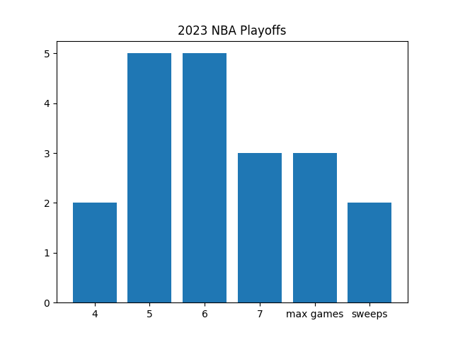
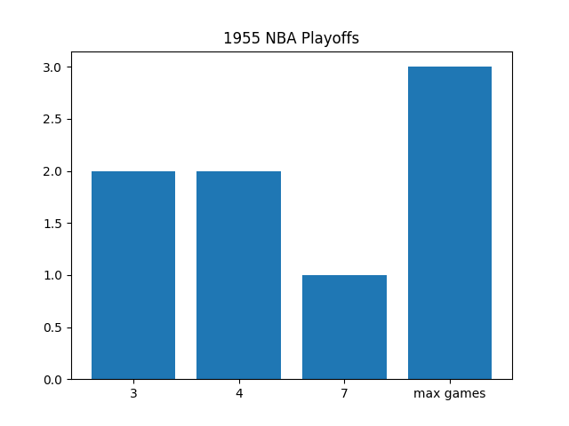
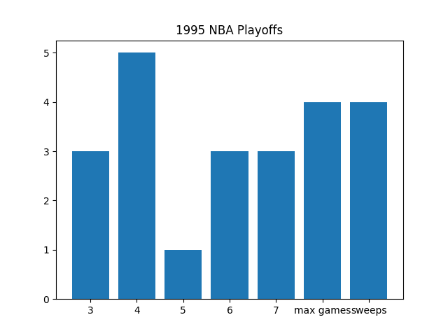

# Frequency Diagram for Game Counts in NBA Playoff Series

This program lets you pick a year in NBA history and it will output a bar graph of the frequencies of the total games played in each series. You can see the number of series that resulted in sweeps or maximum games on the graph.

## Examples

Below is an example of the 2023 NBA Playoffs. This is a year after all playoff series became a max of 7 games. There were 2 sweeps (4-0) and 3 series that went the maximum number of games (game 7s).

Below are examples of the 1955 and 1995 seasons. Before 2003, there could've been best-of-3 and best-of-5 series in the playoffs. In these examples, "max games" could also mean series that went to 3 or 5 in the earlier rounds.

